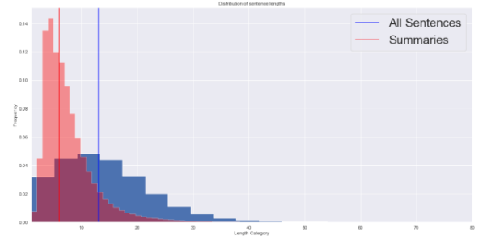
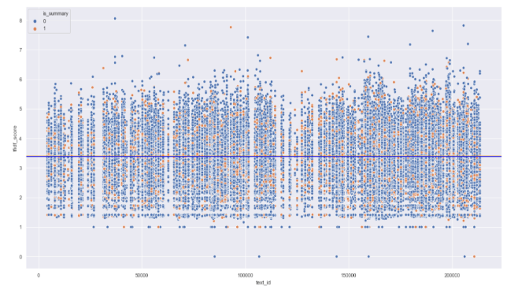
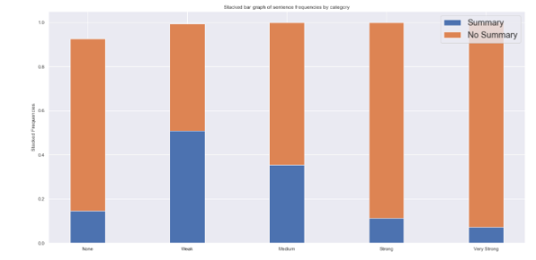
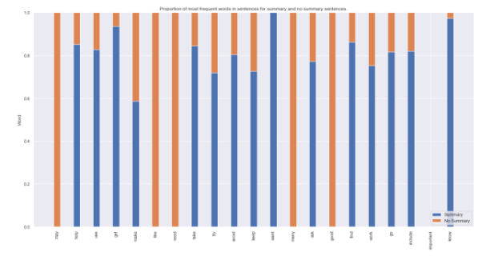

# Feature Extraction

## Surface Features

Surface features are usually extracting information on the structure of the text like the position in the document or paragraph, length (number of words) of the sentence or number of quoted words in a sentence. This comes with the intuition that sentences are more important if the number of words with the exception of stopwords is within a certain range x or that the sentences containing too many quoted words are less important.

In our case, we proceeded to extract the sentence length by counting the number of words in each sentences of the dataset and plotting the distribution of lengths in summary sentences and sentences that are not part of a summary.

When comparing the distributions of `sentence_len` for summary sentences and non summary sentences, we can clearly see the summary sentences are overall shorter than the rest of sentences. This has yet to be confirmed using statistical methods.

## Content Features

We use tf-idf to evaluate how important a sentence is in a document as well as compute the median tf-idf scores for summary sentences vs non-summary sentences. As we can see there is no clear way to distinguish between the two categories based solely on the tf idf sentence score. This can be due to the summary sentences being shorter or very generic.

## Relevance Features

Another useful feature would be to use similarity to exploit intersentence relationship,for example the degree of similarity between a sentence and a title. The idea here is that sentences related to many other sentences are more relevant.

Here we can see that in proportion, non summary sentences show more similarity to the title than summary sentences. As we progress towards stronger similarities, the proportion of summary sentences decreases, this can be because these sentences are generally shorter so they might include less elements similar to the title than longer sentences like non summary sentences.

## Most frequent words in a summary

From sentences with the highest TF-IDF score, we pick the top most important words by computing counts of each different word in the dataset and picking the top verbs.

The top three predominant verbs in summary sentences here are `know`, `get` and `find` which makes sense in the context of wikihow articles, we will later perform statistical tests to confirm that some words are indeed more prevalent in summary sentences.