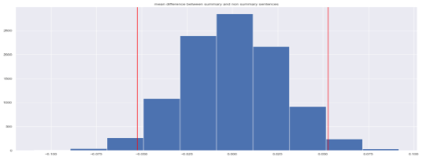
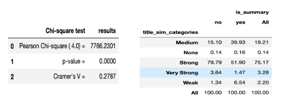
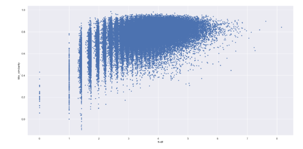

# Statistical Inference

Finally we use statistical methods to confirm a few hypotheses about this dataset.

Testing the difference of mean of sentence lengths

We used bootstrap analysis under the null hypothesis for the average sentence length.

**Null hypothesis** : There is no difference the average sentence length of a summary sentence and the average sentence length of a non summary sentence.

**Alternative hypothesis** : There is a difference the average sentence length of a summary sentence and the average sentence length of a non summary sentence.

The `p-value = 0`, we can then reject the null hypothesis and assume the average sentence length for a summary sentence is significantly smaller than the sentence length for a non summary sentence

Testing the difference in proportions of top common word between summary sentences and non summary sentences (Permutation Test)

Based on the most frequent word in a summary barplot, we pick as an example the verb `make` for which the difference in proportion is not as obvious as the rest of the words in the barplot. We perform a permutation test that results in a very low p-value which in turn makes us reject the null hypothesis and conclude that the word `make` is significantly more present in summary sentences.

## Testing for Independence

- Between `is_summary` and `title_sim_categories` (Chi-Square test)
- Between `tfidf_score` and `title_similarity` (Pearson correlation tests)

### Chi Square test

We use the chi square test for testing relationships between categorical variables.

The null hypothesis is rejected since `p < 0.000` and a conclusion is made that `title_sim_categories` is associated with `is_summary`. The Cramer's V value here is the measure of strength of association between the two variables. In this case, it is closer to 0 than 1 which means there is little association between `title_sim_categories` and `is_summary`.

### Pearson correlation test

These two variables look slightly positively correlated.

Again, the `p-value < 0.000` here which makes our two variables `tfidf_score` and `title_similarity` dependent on one another (we reject the null hypothesis).

## Summary of statistical inference

From this analysis we can note that summary sentences tend to look shorter than regular sentences, we later confirmed that using statistical inference. We can also notice that some verbs are more frequent in summary sentences compared to non summary sentences.

When looking at the similarity to the title, we noticed that in proportion, non summary sentences show more similarity to the title than summary sentences. As we progress towards stronger similarities, the proportion of summary sentences decreases and that this can be due to the specificities of summary sentences in this dataset.