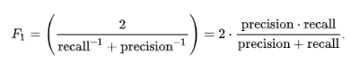

# 🤖 In-depth Analysis

## Supervised methods

The classifiers selected for this analysis were Multinomial Naive Bayes and a Random forest Classifier. We used both to compare their performance in a supervised setting.

We cross validated our training dataset to tune the different hyperparameters in hope of increasing recall without sacrificing too much precision.

We tried to adjust for class imbalance by setting the scoring parameter of GridsearchCV to `f1` and the `class_weight` parameter of the Random Forest Classifier to `balanced`. There are other ways we could try to address the class imbalance like under or oversampling via SMOTE using the imblearn library.

For scoring, we will look at precision and recall as well as the f1 score (harmonic mean of precision and recall) for all the models we used and combinations of features used. We use this scoring because the finality is that the model catches as many summary sentences as possible even if it comes with a little noise.

### BOW Model

We used sklearn's CountVectorizer to  create a simple bag of words model (using a combination of unigrams and bigrams). The reason is that the multinomial naive bayes classifier is best suitable for classification with discrete features and thus requires integer feature counts.

### LDA (Latent Dirichlet Allocation)

It is a generative probabilistic model for collections of discrete data such as text corpora. LDA is a three-level hierarchical Bayesian model, in which each item of a collection is modelled as a finite mixture over an underlying set of topics. Each topic is, in turn, modeled as an infinite mixture over an underlying set of topic probabilities.

The topic probabilities provide an explicit representation of a document.

In the following results, we compare the performance of different models and combinations of features. The key here is to get a reliable summary and thus to achieve a good recall-precision balance for the category labeled as 1 (summary class) in the classification report. For this, we usually look at:

**Precision**: What proportion of summary sentences were actual ones.

  

**Recall**: What proportion of summary sentences were indeed summary sentences.

  

**F1 score**: Harmonic mean of precision and recall with values ranging from 0 to 1. It is a pretty good measure of a test&#39;s accuracy for binary classifications.

  

After looking at those metrics, we plotted the distribution of recalls at the article level for the testing set, which means we calculated the recall for each article and looked at how they are distributed for a specific model. Our goal is to get as many recalls close or equal to 1 as possible.

We then compare the actual and predicted summaries on completely new articles that we feed to our model and view examples of actual Vs predicted. The closer in meaning the predicted summary gets to the actual one the more limited the information loss.

The final step is to see how much &#39;compression&#39; we achieved for each one of these examples, we mean by compression the percentage of original length we end up reading after generating the summary. We also calculate the recall for each article for every model and see what the ratio recall/compression looks like.

### Multinomial Naive Bayes

#### Classification report

  

#### Recall distribution across articles

  

#### Summary samples

| **Real** | **Predicted** |
| --- | --- |
| `Stop what you're doing. Take a break. Focus on your senses. Take some deep breaths. Inhale slowly through your nose. Try to relax your muscles. Get some exercise. Recognize what stress looks like for you. Identify the cause of your stress. Acknowledge your role. Determine if you're stressing about something that is in the past. Determine whether you're stressed about the future. Practice relaxation. Inhale deeply through your nose. Think about something else. Choose your response. Make a plan. Be realistic. Take one step at a time. Stop procrastinating. Practice mindfulness. Try a self compassion break. Use the RAIN reminder. Repeat positive statements. Release stress productively. Cry if you want to. Listen to some soothing music. Take a hot shower or bath` | `Take a break. Focus on your senses. I feel nauseated. Try to relax your muscles. Loosen tight clothing if possible. Give yourself seconds to notice how these areas feel. Give yourself a second relaxation break between groups. Get some exercise. Recognize what stress looks like for you. Identify the cause of your stress. School or work. Acknowledge your role. Take a step back and consider how you think about stress. Determine whether you're stressed about the future. Remember the future isn&#39;t set. Practice relaxation. Think about something else. Choose your response. Be realistic. If that&#39;s the case, revise your timeline or lower your expectations. Learn from your experience, but let it go. Stop procrastinating. Often, perfectionism is a culprit. Watch out for should statements. Practice mindfulness. Try it for minutes a day. Examine the raisin visually. Smell the raisin. Place the raisin on your tongue. Try a self compassion break. Think of the stressful situation. Use the RAIN reminder. Investigate with kindness. Repeat positive statements. Cry if you want to. Listen to some soothing music. Take a hot shower or bath` |
| `Know that everyone has their own unique experience with grief. Acknowledge that there are many kinds of loss. Recognize that stages of mourning do not really exist. Distinguish between grief and mourning. Learn about the necessary tasks of mourning. Acknowledge that you and others may not experience grief the same way. Recognize physical symptoms of grief. Recognize emotional symptoms of grief. Recognize signs of grief in children. Recognize signs of complicated grief. Acknowledge your emotions. Express your feelings through a tangible medium. Acknowledge that your grief is yours. Maintain your physical health. Avoid using alcohol, drugs, or food to deal with your grief. Do things that you enjoy. Prepare for things that may trigger your grief. Pamper yourself. Look to family members and friends for support. Join a support group. Speak with a grief counselor or therapist. Find comfort in the things you believe in. Get involved with your community. Allow yourself to remember your loss. Recognize that you are changed by loss. Allow yourself to feel shock. Recognize denial. Know that you may feel anger. Know that at some point you may make mental bargains. Allow yourself to feel great sadness. Search for acceptance within yourself | Acknowledge your emotions as a natural response. Distinguish between grief and mourning. Learn about the necessary tasks of mourning. Processing grief. Recognize physical symptoms of grief. Recognize emotional symptoms of grief. Grief is emotionally complex and deeply personal. Recognize signs of grief in children. Regressive or immature behaviors. Physical symptoms. Recognize signs of complicated grief. Acknowledge your emotions. Express your feelings through a tangible medium. Acknowledge that your grief is yours. Maintain your physical health. Avoid highly processed foods and foods with a lot of fat or sugar. Focus on the good things about your relationship with your loved one. Pamper yourself. Look to family members and friends for support. Join a support group. Try to focus on positive memories and things you loved about your relationship. Allow yourself to feel shock. Recognize denial. Search for acceptance within yourself` |
| `Think about the time commitment of ferret proofing your home. See if you have enough time to play with a ferret. Remember that ferrets require training. Keep cleaning time in mind. Remember a ferret&#39;s lifespan. Consider other factors. Avoid a ferret if you have young children. Think about how busy your home is. Consider your other pets. Decide whether you can tolerate the smell. Make sure you can legally keep a ferret in your home. Learn about adoption and purchase fees. Make sure you can afford vaccinations. Consider the cost of sterilization. Weigh in other general costs of care | Think about the time commitment of ferret proofing your home. Be honest with yourself about whether you have time for ferret proofing. Ferrets do sleep a lot. Consider other factors. Think about how busy your home is. First, ferrets are underfoot a lot. Consider your other pets. Also, think about legally housing a ferret. Check with your landlord before adopting a ferret. Learn about adoption and purchase fees. Consider the cost of sterilization` |

#### Compression vs. recall

| **Text examples** | **Real Compression** | **Prediction Compression** | **Recall** |
| --- | --- | --- | --- |
| **Text 1** | `0.08` | `0.11` | `0.71` |
| **Text 2** | `0.12` | `0.09` | `0.51` |
| **Text 3** | `0.14` | `0.10` | `0.4` |

### Random Forest Classifier

  

#### Recall distribution across articles

  

#### Summary samples

| **Real** | **Predicted** |
| --- | --- |
| `Stop what you're doing. Take a break. Focus on your senses. Take some deep breaths. Inhale slowly through your nose. Try to relax your muscles. Get some exercise. Recognize what stress looks like for you. Identify the cause of your stress. Acknowledge your role. Determine if you're stressing about something that is in the past. Determine whether you're stressed about the future. Practice relaxation. Inhale deeply through your nose. Think about something else. Choose your response. Make a plan. Be realistic. Take one step at a time. Stop procrastinating. Practice mindfulness. Try a self compassion break. Use the RAIN reminder. Repeat positive statements. Release stress productively. Cry if you want to. Listen to some soothing music. Take a hot shower or bath` | `Stop what you're doing. Take a break. I can do this. Focus on your senses. My heart is beating very fast. My palms feel sweaty. I feel nauseated. Take some deep breaths. Aim to breathe from your diaphragm instead. Inhale slowly through your nose. Hold the breath for seconds. Then, slowly exhale through your nose or mouth. Try to relax your muscles. There are several free guided PMR routines online. MIT has a free minute audio guide to doing PMR. Loosen tight clothing if possible. Breathe evenly as you do your PMR groups. Squeeze your eyes shut tightly for seconds, then release the tension. Give yourself seconds to notice how these areas feel. Move to the next group. Purse your lips tightly for seconds, then release. Give yourself a second relaxation break between groups. Get some exercise. Exercise may also have a preventive effect. Try exercises such as yoga and tai chi. Recognize what stress looks like for you. Identify the cause of your stress. Common sources of stress include Family. School or work. You may worry about feeling good enough. Acknowledge your role. Take a step back and consider how you think about stress. Try thinking about your past in a more productive way. Determine whether you're stressed about the future. We all worry about our futures at some point. Remember the future isn&#39;t set. I could even fail the semester. Then, consider whether you could handle it. Chances are almost always yes. Finally, consider the real likelihood that this will occur. Practice relaxation. Inhale deeply through your nose. Think about something else. Get away from the cause of the stress. Acknowledge that anxiety is not always bad. Choose your response. You can choose to refocus your thinking. Consider some questions when deciding your approach. Can you avoid it? Can you alter it? Can you accept it? Some things you simply cannot change. You cannot change or control others feelings, actions, or reactions. Make a plan. Additionally, many stressful situations are avoidable. An ounce of prevention is worth a pound of cure. Be realistic. Learn from your experience, but let it go. Take one step at a time. Just focus on one small goal at a time. Stop procrastinating. Often, perfectionism is a culprit. Remind yourself that you cannot control outcomes, only actions. Acknowledge that perfection is an unrealistic standard. Watch out for should statements. Everyone makes mistakes in life. Practice mindfulness. Stress can be a great motivator. Try it for minutes a day. Begin with a handful of raisins. Take one between your fingers and hold it. Make a mental note of what the raisin feels like. Examine the raisin visually. Notice its colors, its shape, its textures. Smell the raisin. Enjoy any aroma that you smell. Try to describe it to yourself. Place the raisin on your tongue. Notice how it feels there. Can you feel the weight? Taste the raisin by taking a small bite. Swallow the raisin. What muscles are you using? What does it feel like? Try a self compassion break. Think of the stressful situation. Use the RAIN reminder. It stands for Recognizing what is going on. Investigate with kindness. She makes me so mad. I made a mistake that I can acknowledge. We can work together to solve this issue. Natural awareness arises from not over personalizing the experience. Avoid having your TV, computer, or cellphone on. Close your eyes and breathe evenly and deeply. Begin by focusing just on your breath. Notice your sensations without judgment. MIT and the UCLA Mindful Awareness Research Center both have online MP meditations. Repeat positive statements. I can do my best. That is enough. I am bigger than my problems. My mistakes do not define me. I am human. We all make errors. Release stress productively. Cry if you want to. Listen to some soothing music. Take a hot shower or bath` |
| `Know that everyone has their own unique experience with grief. Acknowledge that there are many kinds of loss. Recognize that stages of mourning do not really exist. Distinguish between grief and mourning. Learn about the necessary tasks of mourning. Acknowledge that you and others may not experience grief the same way. Recognize physical symptoms of grief. Recognize emotional symptoms of grief. Recognize signs of grief in children. Recognize signs of complicated grief. Acknowledge your emotions. Express your feelings through a tangible medium. Acknowledge that your grief is yours. Maintain your physical health. Avoid using alcohol, drugs, or food to deal with your grief. Do things that you enjoy. Prepare for things that may trigger your grief. Pamper yourself. Look to family members and friends for support. Join a support group. Speak with a grief counselor or therapist. Find comfort in the things you believe in. Get involved with your community. Allow yourself to remember your loss. Recognize that you are changed by loss. Allow yourself to feel shock. Recognize denial. Know that you may feel anger. Know that at some point you may make mental bargains. Allow yourself to feel great sadness. Search for acceptance within yourself | Know that everyone has their own unique experience with grief. Allow yourself to feel your own unique emotions and acknowledge your unique experience. Acknowledge that there are many kinds of loss. Do not be afraid to mourn. Acknowledge your emotions as a natural response. There are many losses you may experience in life. No loss is greater or less than any other. Recognize that stages of mourning do not really exist. Avoid expecting yourself to progress through particular stages. Elisabeth Kübler Ross famously defined five stages of emotional reaction to death and dying in. These stages are denial, anger, bargaining, depression, and acceptance. Distinguish between grief and mourning. Grief includes your emotions and thoughts after you experience a loss. You cannot control your experience of grief. Grief may feel like a rollercoaster. The full mourning process may take years, even a lifetime. Learn about the necessary tasks of mourning. These tasks are Accepting the reality of loss. This can take time. Processing grief. Grief in response to a loss is a natural emotional reaction. Adjusting to the world after loss. Recognize physical symptoms of grief. Recognize emotional symptoms of grief. Grief is emotionally complex and deeply personal. These are all natural reactions to grief. Recognize signs of grief in children. These signs include Emotional shock. S he may refuse to talk about the loss. Regressive or immature behaviors. Explosive behavior and misbehaving. Repeating questions. Defensive behavior. Defensive behavior attempts to distract the child from his or her feelings. Physical symptoms. Grief and anxiety often manifest themselves in physical symptoms, particularly in very young children. Symptoms such as headaches and stomachaches are common. Recognize signs of complicated grief. Acknowledge your emotions. Express your feelings through a tangible medium. Acknowledge that your grief is yours. Maintain your physical health. Eat a healthy, balanced diet with plenty of fresh fruits and vegetables, whole grains, and lean proteins. These may worsen feelings of depression. Get at least minutes of moderate physical exercise per day. Avoid using alcohol, drugs, or food to deal with your grief. Use these as prescribed by your doctor. Do things that you enjoy. Prepare for things that may trigger your grief. This is completely normal. Pamper yourself. Look to family members and friends for support. Join a support group. Speak with a grief counselor or therapist. Find comfort in the things you believe in. Get involved with your community. Allow yourself to remember your loss. Allow yourself to remember your loved one. Do what feels best for you. Recognize that you are changed by loss. Allow yourself to feel shock. This is normal. Recognize denial. Know that you may feel anger. You might find yourself dwelling on if onlys. Allow yourself to feel great sadness. You may feel empty or depressed. Search for acceptance within yourself` |
| `Think about the time commitment of ferret proofing your home. See if you have enough time to play with a ferret. Remember that ferrets require training. Keep cleaning time in mind. Remember a ferret&#39;s lifespan. Consider other factors. Avoid a ferret if you have young children. Think about how busy your home is. Consider your other pets. Decide whether you can tolerate the smell. Make sure you can legally keep a ferret in your home. Learn about adoption and purchase fees. Make sure you can afford vaccinations. Consider the cost of sterilization. Weigh in other general costs of care` | `Think about the time commitment of ferret proofing your home. Ferrets will chew such objects. Ferrets are social animals. Ferrets do sleep a lot. Remember that ferrets require training. Also, ferrets must be taught proper behavior. Ferrets are intelligent and highly trainable. However, like any animal, training takes time and persistence. Keep cleaning time in mind. Remember a ferret&#39;s lifespan. Ferrets live between two years. Think about the stability of your living situation. Consider other factors. Avoid a ferret if you have young children. Ferrets do not do well with young children. Ferrets will bite if handled roughly. Think about how busy your home is. First, ferrets are underfoot a lot. Second, ferrets have a tendency to escape. Consider your other pets. Cats and dogs are often aggressive with ferrets. Decide whether you can tolerate the smell. Ferrets come with a strong odor. The scent glands a ferret uses to mark territory secrete oil, leaving a musty scent in your home. Also, think about legally housing a ferret. Check with your landlord before adopting a ferret. Learn about adoption and purchase fees. Ferrets are not cheap. Not all vets are familiar with treating ferrets. Consider the cost of sterilization. Weigh in other general costs of care` |

#### Compression vs. recall

| **Text examples** | **Real Compression** | **Prediction Compression** | **Recall** |
| --- | --- | --- | --- |
| **Text 1** | `0.08`  | `0.32`  | `0.96` |
| **Text 2** | `0.11`  | `0.25`  | `0.93` |
| **Text 3** | `0.14`  | `0.29`  | `0.8` |

### Random Forest Classifier (all the features + LDA)

#### Classification report

  

#### Recall distribution across articles

  

#### Summary samples

| **Real** | **Predicted** |
| --- | --- |
| `Stop what you're doing. Take a break. Focus on your senses. Take some deep breaths. Inhale slowly through your nose. Try to relax your muscles. Get some exercise. Recognize what stress looks like for you. Identify the cause of your stress. Acknowledge your role. Determine if you're stressing about something that is in the past. Determine whether you're stressed about the future. Practice relaxation. Inhale deeply through your nose. Think about something else. Choose your response. Make a plan. Be realistic. Take one step at a time. Stop procrastinating. Practice mindfulness. Try a self compassion break. Use the RAIN reminder. Repeat positive statements. Release stress productively. Cry if you want to. Listen to some soothing music. Take a hot shower or bath` | `Stop what you're doing. Take a break. I can do this. Focus on your senses. My heart is beating very fast. My palms feel sweaty. I feel nauseated. Take some deep breaths. Aim to breathe from your diaphragm instead. Inhale slowly through your nose. Hold the breath for seconds. Then, slowly exhale through your nose or mouth. Aim to exhale for a count if you can. Try to relax your muscles. PMR focuses on consciously tensing and then releasing muscles by groups. There are several free guided PMR routines online. Berkeley has a script you can follow along with. MIT has a free minute audio guide to doing PMR. Find a quiet, comfortable place if you can. Loosen tight clothing if possible. Breathe evenly as you do your PMR groups. Give yourself seconds to notice how these areas feel. Move to the next group. Purse your lips tightly for seconds, then release. Give yourself a second relaxation break between groups. Get some exercise. Exercise may also have a preventive effect. Try exercises such as yoga and tai chi. Recognize what stress looks like for you. Identify the cause of your stress. Common sources of stress include Family. School or work. These sources can be intense. You may worry about feeling good enough. Acknowledge your role. Take a step back and consider how you think about stress. For example, perhaps you think, My family are all worriers. Try thinking about your past in a more productive way. Determine whether you're stressed about the future. We all worry about our futures at some point. Remember the future isn&#39;t set. I could even fail the semester. Then, consider whether you could handle it. Chances are almost always yes. Finally, consider the real likelihood that this will occur. Practice relaxation. Inhale deeply through your nose. Think about something else. Visualize relaxing things, such as a deserted island or a country road. Get away from the cause of the stress. Acknowledge that anxiety is not always bad. Choose your response. You can choose to refocus your thinking. Consider some questions when deciding your approach. Can you avoid it? You can sometimes avoid stressors, thereby changing the situation. Can you alter it. Can you adapt to it? Can you accept it? Some things you simply cannot change. You cannot change or control others feelings, actions, or reactions. Make a plan. Additionally, many stressful situations are avoidable. An ounce of prevention is worth a pound of cure. Be realistic. Learn from your experience, but let it go. Take one step at a time. Just focus on one small goal at a time. Show yourself patience and kindness as you enact your plans. Stop procrastinating. Often, perfectionism is a culprit. Remind yourself that you cannot control outcomes, only actions. The rest of it is out of your hands. Acknowledge that perfection is an unrealistic standard. Watch out for should statements. Everyone makes mistakes in life. Practice mindfulness. Stress can be a great motivator. Try it for minutes a day. Begin with a handful of raisins. Take one between your fingers and hold it. Turn it around, notice its texture, its ridges and valleys. Make a mental note of what the raisin feels like. Examine the raisin visually. Notice its colors, its shape, its textures. Smell the raisin. Enjoy any aroma that you smell. Try to describe it to yourself. Place the raisin on your tongue. Notice how it feels there. Can you feel the weight? Taste the raisin by taking a small bite. Try to discern what muscles you are using to chew. Swallow the raisin. What muscles are you using. What does it feel like? Try a self compassion break. Think of the stressful situation. Use the RAIN reminder. It stands for Recognizing what is going on. For example, I am feeling very angry and stressed right now. Investigate with kindness. She makes me so mad. I made a mistake that I can acknowledge. We can work together to solve this issue. Natural awareness arises from not over personalizing the experience. Begin by finding a quiet place without distractions or interruptions. Avoid having your TV, computer, or cellphone on. Close your eyes and breathe evenly and deeply. Begin by focusing just on your breath. Notice your sensations without judgment. You can also find free audio meditations online. MIT and the UCLA Mindful Awareness Research Center both have online MP meditations. Repeat positive statements. Here are some examples I can do this. I can do my best. That is all I can do. That is enough. I am bigger than my problems. My mistakes do not define me. I am human. We all make errors. This is temporary and will pass. I can ask for help when I need it. Release stress productively. Try something less harmful, like squeezing a stress ball or doodling. Cry if you want to. Sometimes, you just need to cry. Listen to some soothing music. Take a hot shower or bath` |
| `Know that everyone has their own unique experience with grief. Acknowledge that there are many kinds of loss. Recognize that stages of mourning do not really exist. Distinguish between grief and mourning. Learn about the necessary tasks of mourning. Acknowledge that you and others may not experience grief the same way. Recognize physical symptoms of grief. Recognize emotional symptoms of grief. Recognize signs of grief in children. Recognize signs of complicated grief. Acknowledge your emotions. Express your feelings through a tangible medium. Acknowledge that your grief is yours. Maintain your physical health. Avoid using alcohol, drugs, or food to deal with your grief. Do things that you enjoy. Prepare for things that may trigger your grief. Pamper yourself. Look to family members and friends for support. Join a support group. Speak with a grief counselor or therapist. Find comfort in the things you believe in. Get involved with your community. Allow yourself to remember your loss. Recognize that you are changed by loss. Allow yourself to feel shock. Recognize denial. Know that you may feel anger. Know that at some point you may make mental bargains. Allow yourself to feel great sadness. Search for acceptance within yourself` | `Acknowledge that there are many kinds of loss. Do not be afraid to mourn. Acknowledge your emotions as a natural response. There are many losses you may experience in life. No loss is greater or less than any other. Recognize that stages of mourning do not really exist. Avoid expecting yourself to progress through particular stages. These stages are denial, anger, bargaining, depression, and acceptance. Distinguish between grief and mourning. Grief includes your emotions and thoughts after you experience a loss. You cannot control your experience of grief. Many cultures and religions offer guidelines for how to mourn. Grief may feel like a rollercoaster. The full mourning process may take years, even a lifetime. Learn about the necessary tasks of mourning. These tasks are Accepting the reality of loss. This can take time. Processing grief. Grief in response to a loss is a natural emotional reaction. Adjusting to the world after loss. Recognize physical symptoms of grief. Recognize emotional symptoms of grief. Grief is emotionally complex and deeply personal. These are all natural reactions to grief. Recognize signs of grief in children. These signs include Emotional shock. S he may refuse to talk about the loss. Regressive or immature behaviors. Explosive behavior and misbehaving. The child may act out or explode with sudden bursts of emotion. These emotions commonly include feelings of anger, frustration, confusion, or helplessness. Repeating questions. Defensive behavior. Physical symptoms. Symptoms such as headaches and stomachaches are common. Recognize signs of complicated grief. Acknowledge your emotions. Express your feelings through a tangible medium. Personal rituals may also help you process your grief. Acknowledge that your grief is yours. One good example of this is crying. Maintain your physical health. These may worsen feelings of depression. Use these as prescribed by your doctor. Do things that you enjoy. Prepare for things that may trigger your grief. This is completely normal. Pamper yourself. Look to family members and friends for support. Join a support group. Speak with a grief counselor or therapist. Find comfort in the things you believe in. Get involved with your community. Allow yourself to remember your loss. Allow yourself to remember your loved one. Do what feels best for you. Recognize that you are changed by loss. Allow yourself to feel shock. This is normal. Recognize denial. Know that you may feel anger. Anger can be directed at a certain person, event, or thing. You might find yourself dwelling on if onlys. Allow yourself to feel great sadness. You may feel empty or depressed. Search for acceptance within yourself` |
| `Think about the time commitment of ferret proofing your home. See if you have enough time to play with a ferret. Remember that ferrets require training. Keep cleaning time in mind. Remember a ferret&#39;s lifespan. Consider other factors. Avoid a ferret if you have young children. Think about how busy your home is. Consider your other pets. Decide whether you can tolerate the smell. Make sure you can legally keep a ferret in your home. Learn about adoption and purchase fees. Make sure you can afford vaccinations. Consider the cost of sterilization. Weigh in other general costs of care` | `Think about the time commitment of ferret proofing your home. Ferrets will chew such objects. Ferrets are social animals. Ferrets do sleep a lot. Remember that ferrets require training. Also, ferrets must be taught proper behavior. Ferrets are intelligent and highly trainable. However, like any animal, training takes time and persistence. Keep cleaning time in mind. You will also need to periodically clean their cage. Remember a ferret&#39;s lifespan. Ferrets live between two years. Think about the stability of your living situation. Consider other factors. Avoid a ferret if you have young children. Ferrets do not do well with young children. Ferrets will bite if handled roughly. Ferrets can get along well with older children, however. Think about how busy your home is. First, ferrets are underfoot a lot. Second, ferrets have a tendency to escape. Consider your other pets. Ferrets generally do best in a home without other pets. Cats and dogs are often aggressive with ferrets. Ferrets will pray on smaller animals, like mice and rats. Even during play, a dog or cat could accidentally harm a ferret. Decide whether you can tolerate the smell. Ferrets come with a strong odor. The scent glands a ferret uses to mark territory secrete oil, leaving a musty scent in your home. Also, think about legally housing a ferret. Check with your landlord before adopting a ferret. Learn about adoption and purchase fees. Ferrets are not cheap. Make sure you can afford vaccinations. Like all animals, ferrets need basic vaccinations to prevent diseases like rabies. Not all vets are familiar with treating ferrets. Consider the cost of sterilization. Weigh in other general costs of care. You will need extra money for vet bills.` |

#### Compression vs. recall

| **Text examples** | **Real Compression** | **Prediction Compression** | **Recall** |
| --- | --- | --- | --- |
| **Text 1** | `0.08` | `0.38` | `0.96` |
| **Text 2** | `0.11` | `0.25` | `0.87` |
| **Text 3** | `0.14` | `0.37` | `0.87` |

### Multinomial Naive Bayes (all the features + LDA)

#### Classification report

  

#### Recall distribution across all articles

  

#### Summary samples

| **Real** | **Predicted** |
| --- | --- |
| `Stop what you're doing. Take a break. Focus on your senses. Take some deep breaths. Inhale slowly through your nose. Try to relax your muscles. Get some exercise. Recognize what stress looks like for you. Identify the cause of your stress. Acknowledge your role. Determine if you're stressing about something that is in the past. Determine whether you're stressed about the future. Practice relaxation. Inhale deeply through your nose. Think about something else. Choose your response. Make a plan. Be realistic. Take one step at a time. Stop procrastinating. Practice mindfulness. Try a self compassion break. Use the RAIN reminder. Repeat positive statements. Release stress productively. Cry if you want to. Listen to some soothing music. Take a hot shower or bath` | `Take a break. Focus on your senses. I feel nauseated. Try to relax your muscles. Loosen tight clothing if possible. Give yourself seconds to notice how these areas feel. Give yourself a second relaxation break between groups. Get some exercise. Recognize what stress looks like for you. Identify the cause of your stress. School or work. Acknowledge your role. Take a step back and consider how you think about stress. Determine whether you're stressed about the future. Remember the future isn&#39;t set. Practice relaxation. Think about something else. Choose your response. Be realistic. If that&#39;s the case, revise your timeline or lower your expectations. Learn from your experience, but let it go. Stop procrastinating. Often, perfectionism is a culprit. Watch out for should statements. Practice mindfulness. Try it for minutes a day. Examine the raisin visually. Smell the raisin. Place the raisin on your tongue. Try a self compassion break. Think of the stressful situation. Use the RAIN reminder. Investigate with kindness. Repeat positive statements. I am human. Cry if you want to. Listen to some soothing music. Take a hot shower or bath` |
| `Know that everyone has their own unique experience with grief. Acknowledge that there are many kinds of loss. Recognize that stages of mourning do not really exist. Distinguish between grief and mourning. Learn about the necessary tasks of mourning. Acknowledge that you and others may not experience grief the same way. Recognize physical symptoms of grief. Recognize emotional symptoms of grief. Recognize signs of grief in children. Recognize signs of complicated grief. Acknowledge your emotions. Express your feelings through a tangible medium. Acknowledge that your grief is yours. Maintain your physical health. Avoid using alcohol, drugs, or food to deal with your grief. Do things that you enjoy. Prepare for things that may trigger your grief. Pamper yourself. Look to family members and friends for support. Join a support group. Speak with a grief counselor or therapist. Find comfort in the things you believe in. Get involved with your community. Allow yourself to remember your loss. Recognize that you are changed by loss. Allow yourself to feel shock. Recognize denial. Know that you may feel anger. Know that at some point you may make mental bargains. Allow yourself to feel great sadness. Search for acceptance within yourself` | `Acknowledge your emotions as a natural response. Distinguish between grief and mourning. Learn about the necessary tasks of mourning. Processing grief. Recognize physical symptoms of grief. Recognize emotional symptoms of grief. Grief is emotionally complex and deeply personal. Recognize signs of grief in children. Regressive or immature behaviors. Defensive behavior. Physical symptoms. Recognize signs of complicated grief. Acknowledge your emotions. Express your feelings through a tangible medium. Acknowledge that your grief is yours. Maintain your physical health. Avoid highly processed foods and foods with a lot of fat or sugar. Focus on the good things about your relationship with your loved one. Pamper yourself. Look to family members and friends for support. Join a support group. Try to focus on positive memories and things you loved about your relationship. Allow yourself to feel shock. Recognize denial. Search for acceptance within yourself` |
| `Think about the time commitment of ferret proofing your home. See if you have enough time to play with a ferret. Remember that ferrets require training. Keep cleaning time in mind. Remember a ferret&#39;s lifespan. Consider other factors. Avoid a ferret if you have young children. Think about how busy your home is. Consider your other pets. Decide whether you can tolerate the smell. Make sure you can legally keep a ferret in your home. Learn about adoption and purchase fees. Make sure you can afford vaccinations. Consider the cost of sterilization. Weigh in other general costs of care` | `Think about the time commitment of ferret proofing your home. Ferrets will chew such objects. Ferrets do sleep a lot. Remember a ferret&#39;s lifespan. Think about the stability of your living situation. Consider other factors. Think about how busy your home is. First, ferrets are underfoot a lot. Consider your other pets. Also, think about legally housing a ferret. Check with your landlord before adopting a ferret. Learn about adoption and purchase fees. Consider the cost of sterilization` |

#### Compression vs. recall

| **Text examples** | **Real Compression** | **Prediction Compression** | **Recall** |
| --- | --- | --- | --- |
| **Text 1** | `0.08` | `0.11` | `0.71` |
| **Text 2** | `0.12` | `0.09` | `0.51` |
| **Text 3** | `0.14` | `0.12` | `0.47` |

When we look at our key metrics for evaluating performance, we can see that the best model in our case is the Multinomial Naive Bayes + LDA  which is only slightly better than the simple Multinomial Naive Bayes model.

More generally both Multinomial Naive Bayes (with and without LDA) perform better than the  Random Forest Classifier. This doesn't necessarily mean that adding LDA to a Multinomial Naive Bayes model will always result in a better performance in comparison to the same model but without adding the LDA feature as other unidentified factors may be involved.

When we look at both Random Forest Classifier examples of predicted summaries, they are generally much longer than the real summaries which corresponds to the low precision of these models for the summary class.

This defeats the purpose of summarization which tries to minimize reading time (summary text length) and maximize information gain (highest possible real summary sentences concentration) for selection purposes.

Finally, when we look at the behavior of the predicted compression compared to the real compression ratios, we can see a tendency for the Random Forest classifiers to "compress" less meaning they retain more summary sentences than the actual summary which logically increases the odds of the recall being high.

On the other hand, for the Multinomial Naive Bayes models the compression is more or less similar to the real compression but in these cases the recall values tend to fluctuate more. One hypothesis to help stabilize the recalls would be for example adding more training data consisting of longer texts to allow the model to select more actual summary sentences.

## Unsupervised Method

As an unsupervised method we used LDA with K-Means to see how efficiently summary and non summary sentences can be identified as  different clusters.

### LDA+KMEANS

  

We can see here a very high recall but a significant drop in precision, it is basically always right because it considers the vast majority of sentences as belonging to one class which means it would select most of the summary sentences.

[**Next: 🤔 Conclusion**](07-conclusion.md)